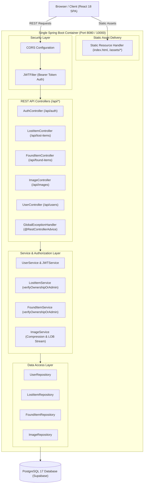

# 🧭 Lostoria

**A full-stack web platform for reporting, tracking, and recovering lost and found items in campus and community environments.**

[](https://openjdk.org/)
[](https://spring.io/projects/spring-boot)
[](https://www.postgresql.org/)
[](https://react.dev/)
[](https://www.docker.com/)

---

## 🌐 Live Demo

🔗 **[https://lostoria.onrender.com/](https://lostoria.onrender.com/)**
> *Note: Hosted on Render's free tier. The instance may take ~30–50 seconds to spin up on the initial request after a period of inactivity.*

---

## ✨ Features

- **Stateless JWT Authentication**: User registration and login powered by Spring Security, BCrypt password hashing, and 24-hour signed JWT tokens.
- **Lost & Found Reporting**: Create listings for lost or found items with multipart photo uploads (`multipart/form-data`) and local datetime preservation.
- **Search & Filtering**: Real-time client-side search across item titles, locations, and descriptions, with status filtering (All, Lost, Found).
- **Ownership-Based Authorization**:
  - Item mutations (`PUT`, `DELETE`) are strictly restricted to the user who reported the item.
  - Role-based administrator override (`Role.ADMIN`) to manage or moderate any listing.
  - Unauthorized mutations reject with `403 Forbidden`.
- **In-Database Image Pipeline**: Uploaded images are compressed using `Deflater`, stored in PostgreSQL Large Objects (`@Lob`), and streamed via unique ID lookups (`/api/images/view/id/{imageId}`).
- **Global Error Handling & Validation**: Centralized `@RestControllerAdvice` returning structured `ErrorResponse` envelopes (`{ timestamp, status, error, message, path, errors? }`) backed by Jakarta Bean Validation (`@NotBlank`, `@Size`, `@Email`).
- **Single-Port Unified Deployment**: The React single-page application is built directly into Spring Boot static resources, allowing the entire full-stack application to run on a single port.

---

## 🛠️ Tech Stack

### Backend
- **Language**: Java 21 (LTS)
- **Framework**: Spring Boot 3.4.5
- **Security**: Spring Security 6, JJWT (`0.12.6`), BCrypt Password Encoding
- **Persistence**: Spring Data JPA, Hibernate 6.6, HikariCP
- **Validation**: Jakarta Bean Validation (`spring-boot-starter-validation`, Hibernate Validator)
- **Database**: PostgreSQL 17 (Supabase Pooler / Local PostgreSQL)
- **Compression**: In-memory `Deflater` / `Inflater` for byte array image compression

### Frontend
- **Framework**: React 18
- **Build Tool**: Vite (configured to output to `src/main/resources/static/`)
- **Icons**: Lucide React
- **Styling**: Vanilla CSS with custom dark glassmorphism design system

### Infrastructure & Hosting
- **Containerization**: Multi-stage `Dockerfile` (Maven 3.9 + Eclipse Temurin 21 JRE)
- **Database Host**: Supabase (PostgreSQL 17)
- **Application Deployment**: Render

---

## 🏛️ Architecture

Lostoria uses a single-container architecture where the compiled React SPA assets (`index.html`, JavaScript, CSS) are packaged directly into the Spring Boot application's static resource directory. A unified Spring Boot server processes REST API requests under `/api/**`, validates stateless JWT tokens via `JWTFilter`, enforces data ownership in the service layer, and serves the frontend client over a single HTTP port.



---
## 📡 API Overview
### Authentication (`/api/auth`)
| Method | Path | Auth Required | Description |
| :--- | :--- | :--- | :--- |
| `POST` | `/api/auth/register` | No | Register a new user account with validated username, email, and password |
| `POST` | `/api/auth/login` | No | Authenticate with username/email & password; returns JWT token + user profile |
### Lost Items (`/api/lost-items`)
| Method | Path | Auth Required | Description |
| :--- | :--- | :--- | :--- |
| `GET` | `/api/lost-items` | No | Retrieve all lost item listings |
| `GET` | `/api/lost-items/{id}` | No | Retrieve single lost item by ID |
| `POST` | `/api/lost-items` | Yes (Bearer JWT) | Report a lost item with optional multipart photo (`reportedBy` set automatically) |
| `PUT` | `/api/lost-items/{id}` | Yes (Bearer JWT) | Update lost item details (owner or ADMIN only; 403 on unauthorized attempt) |
| `DELETE` | `/api/lost-items/{id}` | Yes (Bearer JWT) | Delete lost item listing (owner or ADMIN only; 403 on unauthorized attempt) |

### Found Items (`/api/found-items`)
| Method | Path | Auth Required | Description |
| :--- | :--- | :--- | :--- |
| `GET` | `/api/found-items` | No | Retrieve all found item listings |
| `GET` | `/api/found-items/{id}` | No | Retrieve single found item by ID |
| `POST` | `/api/found-items` | Yes (Bearer JWT) | Report a found item with optional photo (accepts multipart or JSON) |
| `PUT` | `/api/found-items/{id}` | Yes (Bearer JWT) | Update found item details (owner or ADMIN only; 403 on unauthorized attempt) |
| `DELETE` | `/api/found-items/{id}` | Yes (Bearer JWT) | Delete found item listing (owner or ADMIN only; 403 on unauthorized attempt) |
### Images (`/api/images`)
| Method | Path | Auth Required | Description |
| :--- | :--- | :--- | :--- |
| `GET` | `/api/images/view/id/{imageId}` | No | Stream raw decompressed image binary (`image/jpeg`, `image/png`) |
| `POST` | `/api/images/upload/lost/{id}` | Yes (Bearer JWT) | Upload and attach photo to an existing lost item |
| `POST` | `/api/images/upload/found/{id}` | Yes (Bearer JWT) | Upload and attach photo to an existing found item |
### Users (`/api/users`)
| Method | Path | Auth Required | Description |
| :--- | :--- | :--- | :--- |
| `GET` | `/api/users` | Yes (Bearer JWT) | Retrieve list of all registered users |
| `GET` | `/api/users/{id}` | Yes (Bearer JWT) | Retrieve user details by ID |
| `PUT` | `/api/users/{id}` | Yes (Bearer JWT) | Update user profile |
| `DELETE` | `/api/users/{id}` | Yes (Bearer JWT) | Delete user account by ID (returns 204 No Content) |
---
## 🚀 Getting Started Locally
### Prerequisites
- **Java 21 JDK** installed and configured in `JAVA_HOME`
- **Node.js 18+** & **npm** (for frontend builds)
- **PostgreSQL 17** (local instance or cloud database such as Supabase)
- **Docker** (optional, for containerized execution)
### 1. Clone the Repository
```bash
git clone https://github.com/Naveenkus/Lost-Found-Portal.git
cd Lost-Found-Portal
```
### 2. Configure Environment Variables
Set the following environment variables in your terminal or `.env` configuration:
```bash
# PostgreSQL Connection
export DB_URL="jdbc:postgresql://localhost:5432/postgres"
export DB_USERNAME="postgres"
export DB_PASSWORD="your_postgres_password"
# Optional: JWT Secret (falls back to default development secret if unset)
export JWT_SECRET="your_512_bit_base64_secret_key"
```
### 3. Build & Run (Local Java Runtime)
#### Build Frontend Assets:
```bash
cd frontend
npm install
npm run build
cd ..
```
#### Run Spring Boot Application:
```bash
# Windows
.\mvnw.cmd spring-boot:run
# Linux / macOS
./mvnw spring-boot:run
```
The application will be accessible at `http://localhost:8080`.
---
### 4. Run via Docker
Build and start the container image using the multi-stage `Dockerfile`:
```bash
docker build -t lostoria:latest .
docker run -p 8080:10000 \
  -e DB_URL="your_database_jdbc_url" \
  -e DB_USERNAME="your_database_username" \
  -e DB_PASSWORD="your_database_password" \
  lostoria:latest
```

Open `http://localhost:8080` in your browser.
---
## 📁 Project Structure
```text
lostoria/
├── pom.xml                               # Maven project configuration (Java 21, Spring Boot 3.4.5)
├── Dockerfile                            # Multi-stage Docker build file
├── frontend/                             # React 18 + Vite frontend source
│   ├── src/
│   │   ├── components/                   # Navbar, ItemCard, ItemModal, EditModal, ReportModal, AuthModal
│   │   ├── api.js                        # Central Fetch API client with Bearer auth injection
│   │   ├── App.jsx                       # Master view, feed state, and modal orchestration
│   │   └── main.jsx                      # React entrypoint
│   ├── vite.config.js                    # Builds directly into ../src/main/resources/static/
│   └── package.json
└── src/
    ├── main/
    │   ├── java/com/example/lostoria/
    │   │   ├── config/                   # SecurityConfig (JWT filter, CORS, DaoAuthProvider)
    │   │   ├── controller/               # AuthController, LostItemController, FoundItemController, ImageController, UserController
    │   │   ├── dto/                      # UserPrincipal, ErrorResponse
    │   │   ├── exception/                # GlobalExceptionHandler (@RestControllerAdvice)
    │   │   ├── model/                    # JPA Entities: User, LostItem, FoundItem, Image
    │   │   ├── repository/               # Spring Data JPA Repositories
    │   │   ├── security/                 # JWTFilter, MyUserDetailsService
    │   │   ├── service/                  # Business logic, ownership verification, image compression
    │   │   └── util/                     # ImageUtility (Deflater/Inflater), Role enum (USER, ADMIN)
    │   └── resources/
    │       ├── application.properties    # App configuration & environment variable mappings
    │       └── static/                   # Compiled React production bundle
    └── test/ 
```
---

## 🗺️ Roadmap & Tracked Decisions
The following items are actively tracked for upcoming iterations:
- **Role Guards on `/api/users` Endpoints**: Add `@PreAuthorize("hasAuthority('ADMIN')")` to restrict user administrative CRUD routes.
- **DTO Projection for Public Feeds**: Sanitize public `reportedBy` user metadata on `GET /api/lost-items` and `GET /api/found-items` to mask reporter email and internal user IDs.
- **Login Query Optimization**: Remove redundant user database lookup in `AuthController.login` after authentication verification.
- **UserController Error Translation**: Update `UserController.updateUser` to throw `ResponseStatusException(HttpStatus.NOT_FOUND)` instead of raw `RuntimeException` to return a 404 envelope rather than hitting the 500 catch-all handler.
- **Backend Pagination & Search**: Implement Spring Data JPA `Pageable` on `/api/lost-items` and `/api/found-items` for scalable feed queries.
---